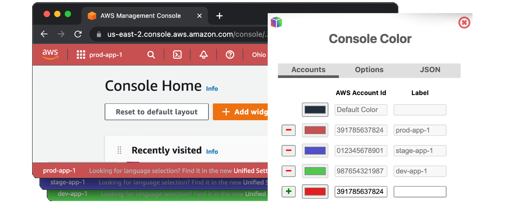

# console-color

[Install Chrome Extension](https://chrome.google.com/webstore/detail/bfcpifkhgghaaomeefpghoegifklojpj/)

Change the color of the AWS console header and footer.

Useful for quickly navigating many AWS console browser windows.

Supports a JSON configuration for users with many accounts to configure.

